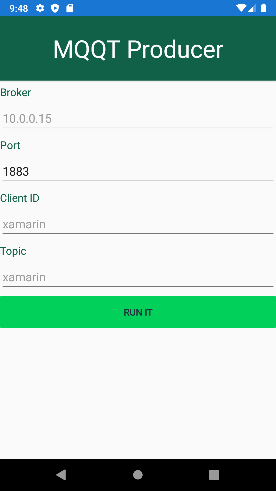
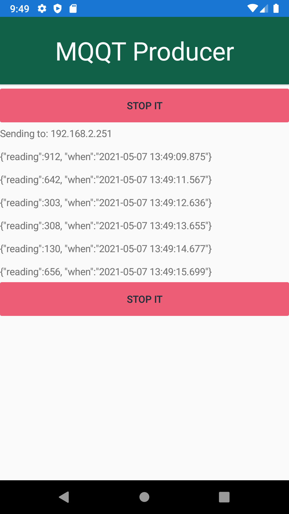

# MQTTProducer-Android
 
 Similar to my other [MQTTProducer](https://github.com/graboskyc/MQTTProducer) but this one runs on Android versus in a docker container

 Sends to the [Realm MQTT Endpoint](https://github.com/graboskyc/MQTTtoRealm)

